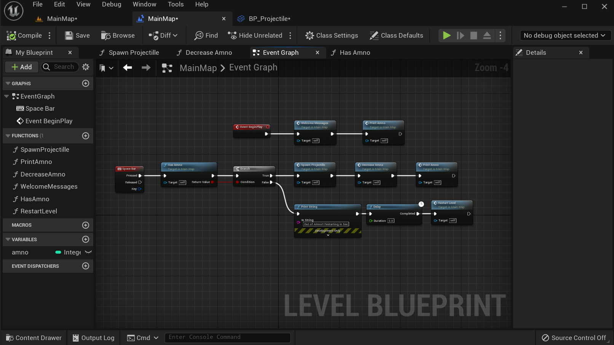

# BlueprintShootingGame
Unreal Engine 5, blueprint shooting game.

:boom:This Games uses the basic principles of Games:

:point_right:Blueprints in Unreal5 as node and pin programming concepts such as variables, strings, references and functions;

:point_right:Unreal basics: maps, actors, components, transforms, vectors;

:point_right:Object-oriented basics: objects, structures, classes, and functions.

The goal of this project was to create a simple shooting game, using only the blueprint tool in UE5.

The image below represents the main level plan with the Event Graph some nodes were shrunk into functions to make the representation visually clean.

